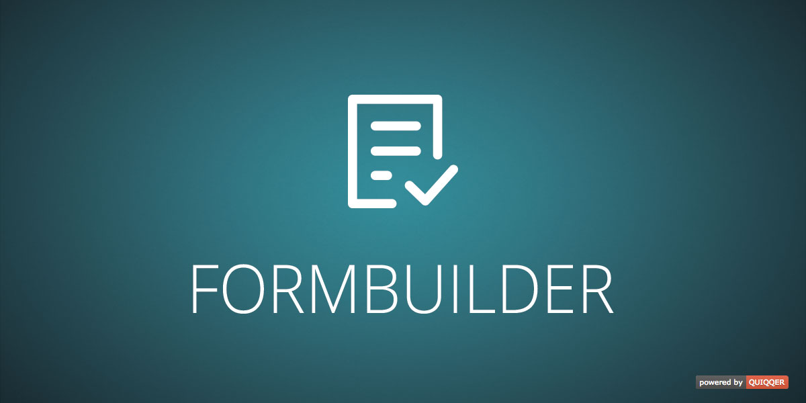

QUIQQER Form Builder
========

The QUIQQER Form Builder plugin offers controls to build custom forms (i.e. like the one used in `quiqqer/contact`)
and validate them. Build forms out of a variety of standard and custom-made form fields.

Package name:

    quiqqer/formbuilder

Features
--------
* FormBuilder control to build forms easily via drag & drop
* API for form validation

Installation
------------
Package name: quiqqer/formbuilder

Usage
----------
#### Frontend
```js
// FormBuilder control
require(['package/quiqqer/formbuilder/bin/FormBuilder'], function(FormBuilderControl) {
    var FormBuilder = new FormBuilderControl().inject(document.body);
    
    // Use form builder to configure your form...
    
    // get form configuration data
    var formData = FormBuilder.save();
    
    // send to backend
    sendFormDataToBackend(formData);
});

```

#### Backend
```php
    $Form = new QUI\FormBuilder\Builder();
    
    $Form->load($formData); // $formData from frontend; usually $formData is retrieved from database (e.g. from a Site)
    
    // show form
    $Engine = QUI::getTemplateManager()->getEngine();
    $Engine->assign('Form', $Form->create()); // display $Form in template engine
    
    // execute this if your form is submitted
    $Form->handleRequest();
    
    if ($Form->isSuccess()) {
        // form was successfully validated
        $formFields = $Form->getElements();
        
        /** @var \QUI\FormBuilder\Interfaces $FormField */
        foreach ($formFields as $FormField) {
            $value = $FormField->getValueText();
            // $value contains the content/option the user chose when the form was submitted        
        }
    } else {
        // form was not successfully validated
    }
```

Collaboration
----------
- Issue Tracker: https://dev.quiqqer.com/quiqqer/package-formbuilder/issues
- Source Code: https://dev.quiqqer.com/quiqqer/package-formbuilder

Support
-------
If you found any bugs or flaws, have any wishes or suggestions you can send an email
to [support@pcsg.de](mailto:support@pcsg.de) to inform us about your concerns. 
We will try to respond to your request and forward it to the responsible developer.

License
-------
PCSG QL-1.0, CC BY-NC-SA 4.0